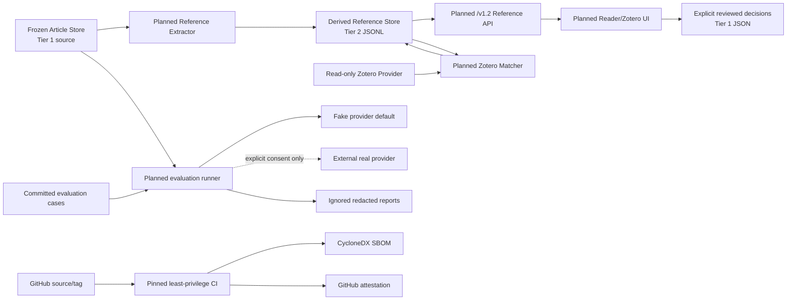

# v1.2 Architecture

Status: Approved planning architecture

Scope Decision: **A**

## System Context

v1.2 adds three independent boundaries around the released local-first system. Structured references are rebuilt from the Article source of truth. Real-provider evaluation is an operator-only, default-off path. CI security operates in GitHub Actions and does not become a product runtime dependency.



All boxes prefixed `Planned` are architecture contracts, not current implementation.

## Component Boundaries

| Boundary | Reads | Writes | Must not do |
| --- | --- | --- | --- |
| Reference extractor | Frozen Article records | Staged derived records/evidence | Fetch network data or mutate Articles/M1 |
| Normalizer/deduplicator | Extracted candidates | Deterministic canonical records and groups | Infer unsupported paper identity |
| Reference Store | Validated staged files | Ignored Tier 2 directory | Store full Article content or Tier 1 decisions |
| Zotero matcher | Reference records and bounded read-only item metadata | Derived candidates only | Write Zotero, M5 links, or decisions |
| Review decision repository | Explicit local user action | Tier 1 decisions | Be deleted with derived rebuilds |
| `/v1.2` API | Valid current store/decisions | None for approved read endpoints | Alter legacy or `/v1.1` responses |
| Real-provider runner | Approved case metadata and bounded snippets | Ignored redacted output | Run without consent/budgets or from CI |
| CI security jobs | Repository/lockfiles/tag | Bounded CI reports, SBOM, attestation | Read/upload local runtime data or gain broad permissions |

## Trust Boundaries

1. **TB1 Repository to local runtime:** tracked code/docs are public project material; `.local_data` may contain corpus, user, Zotero, provider, and review data.
2. **TB2 Frozen Article store to derived builder:** Articles are authoritative read-only inputs; extraction output is disposable and cannot flow back implicitly.
3. **TB3 Local API to browser UI:** API output is bounded and sanitized; local absolute paths and private Zotero fields do not cross.
4. **TB4 Application to Zotero Desktop:** the local API is a separate process containing private library metadata; requests remain read-only and bounded.
5. **TB5 Local evaluator to external provider:** approved snippets leave the machine and become subject to provider logging, retention, rate, and cost policy.
6. **TB6 GitHub repository to CI/release services:** pull-request code and dependencies are untrusted; write permissions exist only in isolated release evidence jobs.

## Reference Pipeline

```text
Article store (read-only)
  -> candidate extraction
  -> type classification
  -> DOI/arXiv/URL/text normalization
  -> exact merge and possible-duplicate grouping
  -> provenance binding
  -> schema/integrity validation
  -> atomic derived-store install
  -> optional read-only Zotero candidate matching
```

### Input Contract

- Required Article fields remain `id`, `title`, `url`, `content`, and `metadata`.
- Required metadata keys remain `date`, `category`, `references`, and `images`.
- The builder computes the same deterministic Article corpus fingerprint convention used by full-corpus derived artifacts, with an explicit fingerprint algorithm version.
- No extraction result is written into Article fields.

### Extraction and Provenance

- Extraction operates on Markdown structure and records the nearest heading as `source_section`; content before any heading uses the exact sentinel `__article_root__`.
- Spans are recorded only when offsets are stable against the exact input string. Otherwise span values are `null`; fabricated offsets are forbidden.
- Candidate length, per-Article candidate count, total work, and regex behavior are bounded. Over-limit candidates are classified, not discarded.
- Evidence is redacted for credential-bearing URLs and bounded for API display while a hash supports deterministic identity.

### Normalization

Detailed rules live in `docs/V1_2_DATA_MODEL.md`. Canonicalization is conservative: only transformations known not to change identity are applied. Raw evidence is retained except when secret-bearing userinfo must be redacted.

### Deduplication

- Exact DOI and exact version-aware arXiv keys merge deterministically.
- Exact normalized HTTP(S) URLs merge only when the full safely normalized URL matches.
- Text similarity creates a possible-duplicate group; it never merges records or creates exact identity.
- Evidence is deduplicated only for the same Article, section, stable span/raw hash, and rule version. Cross-Article evidence is always retained.

## Reference Persistence

### Derived Store Decision

P3-003 uses JSONL plus bounded JSON indexes rather than SQLite:

```text
.local_data/scientific_spaces/references/full_corpus/
├── manifest.json
├── records.jsonl
├── evidence.jsonl
├── article_index.json
├── identifier_index.json
├── zotero_candidates.jsonl
└── reports/
    ├── build_summary.json
    ├── integrity_audit.json
    └── pilot_evaluation.json
```

JSONL matches the current local-first toolchain, supports streaming and deterministic line ordering, and avoids a new database in the pilot. Indexes contain IDs and offsets only; they do not duplicate Article bodies.

### Atomic Lifecycle

1. Resolve the target under ignored `.local_data` and reject symlinks or paths outside the configured data root.
2. Build into a private sibling staging directory.
3. Sort records/evidence by stable IDs, serialize canonically, and compute file hashes and counts.
4. Write the manifest after all payload files, flush files, and validate schema, referential integrity, hashes, indexes, counts, and fingerprints.
5. Move the previous valid directory to one rollback name, install staging with filesystem rename, and restore the previous directory if installation fails.
6. Remove rollback only after the installed store revalidates. Interrupted rollback state is recovered on the next invocation.

For an unchanged corpus fingerprint, schema, extraction rule, and matcher configuration, a validated existing store is a no-op. Content files remain byte-identical; timestamps do not participate in build identity.

### Stale and Corrupt State

- `stale`: schema is readable but corpus fingerprint, extractor version, or matcher fingerprint differs from the requested configuration.
- `corrupt`: a checksum, count, JSON row, index target, required field, or cross-record invariant fails.
- The planned API returns a bounded 503 problem response for stale/corrupt configured stores. It does not silently serve old data or rebuild on request.
- Recovery is explicit delete/rebuild or rollback to the last validated directory. Article data is never restored from the derived store.

### Tier 1 Decisions

Manual confirmations, rejections, corrections, and annotations use a separate atomic JSON repository under `.local_data/scientific_spaces/references/reviewed/decisions.json`. Operations inventory must classify it Tier 1 before cleanup/backup integration. A derived rebuild may reapply compatible decisions by stable identity but cannot delete or rewrite them without explicit migration.

## Zotero Matcher

```text
ReferenceRecord -> ZoteroMatcher -> ZoteroMatchCandidate[]
```

- Provider access uses the existing read-only `ZoteroProvider` boundary.
- Matching is optional and failure-tolerant; extraction PASS does not require Zotero Desktop.
- DOI and version-compatible arXiv exact matches are strong. A conflicting strong identifier forces `ambiguous` or `rejected`.
- A normalized URL match without a strong identifier is `probable`.
- Title/creator/year similarity is review evidence only and remains `ambiguous`.
- Candidate payloads contain only the minimum item key and comparison fields. Complete abstracts, notes, collections, tags, attachments, and library exports are excluded.
- Candidate generation has no write method. Explicit reviewed decisions are a separate future operation and never write to Zotero itself.

## Planned `/v1.2` API

| Endpoint | Purpose | Bounds |
| --- | --- | --- |
| `GET /v1.2/references` | Filtered reference list | page 1+, default 20, max 100 |
| `GET /v1.2/references/{reference_id}` | One record and bounded evidence | provenance default 5, max 20 |
| `GET /v1.2/articles/{article_id}/references` | References for one Article | page default 20, max 100 |
| `GET /v1.2/references/{reference_id}/zotero-candidates` | Minimal candidate comparisons | max 20 |
| `GET /v1.2/reference-summary` | Counts, fingerprints, health, stale state | no records or local paths |

List filters may include `reference_type`, `classification`, `article_id`, and bounded identifier query. Every list reports `items`, `total`, `page`, `page_size`, `total_pages`, `has_next`, and `has_previous`. Existing endpoints receive no new required parameters or response keys.

## Real-Provider Evaluation Boundary

The planned runner extends evaluation infrastructure, not product startup:

```text
fixed cases + validated Article snippets
  -> consent and budget preflight
  -> embedding/chat adapter
  -> response validator and metrics
  -> aggregate + redacted ignored reports
```

### Mandatory Preflight

A real run requires all of:

- `--provider real`
- `--acknowledge-data-sent`
- positive `--max-requests`
- positive `--max-estimated-cost` with a dated pricing source
- explicit `--case-set`
- output below `.local_data/scientific_spaces/evaluation/real_provider/`

The future CLI must print provider/model, endpoint category, case count, maximum calls/cost, sent data categories, Article-snippet policy, and an explicit statement that user/Zotero data is excluded. Missing or contradictory input fails before adapter construction. CI and default startup cannot set the real-run gate.

### Data and Output

- Only case instructions and selected bounded public-corpus snippets are sent.
- Article content is delimited as untrusted evidence and cannot override the evaluation protocol.
- Keys, auth headers, environment secrets, user notes, Learning state, Tutor history, private Zotero metadata, and full corpus are prohibited.
- Aggregate reports may be retained locally. Redacted case reports default to 30-day retention. Raw output is off; a future raw-output mode requires a separate acknowledgement and defaults to 7-day retention.
- Deletion and artifact-audit commands are required before any real execution task can PASS.

## CI Security Architecture

### Immutable Actions and Updates

Current third-party Actions are `actions/checkout@v4`, `actions/setup-python@v5`, and `actions/setup-node@v4`. P3-005 will replace each with a reviewed 40-character commit SHA plus a comment naming the upstream release. Dependabot may open weekly `github-actions` update PRs; every update requires human review and the complete CI gate. Bulk unreviewed pin updates are prohibited.

### Permissions

- Workflow default: `contents: read`.
- Backend/frontend/Docker/dependency/secret jobs: no write permission.
- SARIF upload job only: `security-events: write` when repository/event policy permits; fork PRs never receive secrets or elevated writes.
- Release attestation job only: `id-token: write` and `attestations: write`, plus `contents: read`.
- `packages: write` is not granted because the project publishes no package/container.

### Scanning

- Python: audit the locked `backend/uv.lock` dependency graph with a pinned tool.
- Node: audit `frontend/package-lock.json` with npm plus an independent OSV-compatible lockfile scanner.
- Secrets: pinned scanner over tracked files and a bounded Git-history range, supplemented by GitHub secret scanning when available.
- Critical/High unsuppressed runtime findings fail. Medium findings require triage before release. Low findings remain visible.
- Suppressions are structured, narrowly scoped, owned, linked, and expiring; expired or unmatched suppressions fail policy validation.

### SBOM and Attestation

- Format: CycloneDX 1.6 JSON, covering Python and npm dependencies, project commit, deterministic commit-derived timestamp, and generator versions.
- Components are sorted and normalized; output is capped at 5 MiB and scanned for absolute paths, secrets, and forbidden runtime names.
- Release subjects are the SBOM and a small release-evidence JSON record, not corpus, PDFs, databases, Graph/RAG artifacts, or backups.
- GitHub artifact attestations bind subject digests to the exact tag workflow and commit. Verification uses `gh attestation verify` plus independent tag/commit checks.

## Failure Handling

| Failure | Required behavior |
| --- | --- |
| Invalid reference input | classify malformed/rejected; continue within bounds |
| Extractor exception | classify affected Article/candidate; fail gate if coverage is incomplete |
| Staging validation failure | discard staging; preserve current valid store |
| Install interruption | recover validated rollback; never expose partial store as valid |
| Zotero unavailable | return unavailable/empty bounded result; extraction continues |
| Ambiguous/conflicting match | retain candidate as ambiguous; no write |
| Missing provider consent/budget | fail before network access |
| Provider timeout/rate limit | bounded retry, classify error, enforce request/cost caps |
| Scanner tool failure | fail closed for release gate; do not report PASS |
| SBOM/provenance mismatch | block release; never move an existing tag silently |

## Migration and Rollback

- Reference schema changes require a versioned offline converter or a rebuild from Articles. In-place mutation is prohibited.
- Derived v1 stores are rebuildable; rollback reinstalls the last validated directory or deletes and rebuilds.
- Tier 1 review decisions require explicit backup, schema migration, validation, rollback, and identity-reconciliation reports.
- Any future `metadata.references` backfill requires a separate M1.x task, Article-store backup, atomic new-store creation, compatibility audit, and tested reverse rollback.
- Real-provider report schema migrations operate only on ignored evaluation output and may not become product state.
- CI policy revisions remain reviewable workflow/config changes and must preserve baseline jobs.

## Compatibility

The authoritative matrix is in `docs/V1_2_ACCEPTANCE.md`. Architecture rules are:

- all reference endpoints and UI fetches are additive under `/v1.2`;
- no reference field is injected into legacy or `/v1.1` Article/Graph payloads;
- fake providers and JSON persistence remain defaults;
- Graph, RAG, Tutor, Learning, Zotero, backup, restore, and M1 behavior remain unchanged;
- a future breaking need creates a new versioned contract or separately governed migration, never an opportunistic rewrite.

## Operational Lifecycle

1. Inventory and back up Tier 1 sources and decisions.
2. Build/reuse the derived reference store offline and validate its manifest.
3. Optionally run read-only Zotero candidate matching under explicit local configuration.
4. Serve only a current, validated store through bounded APIs.
5. Rebuild after Article/rule changes; preserve Tier 1 decisions and report stale identities.
6. Run real-provider evaluation only under a separately authorized, bounded task.
7. Run pinned CI and scanners for every change; generate SBOM/attestation only for release evidence.
8. Assign a candidate/tag/Release only after P3-007 and explicit user authorization.
