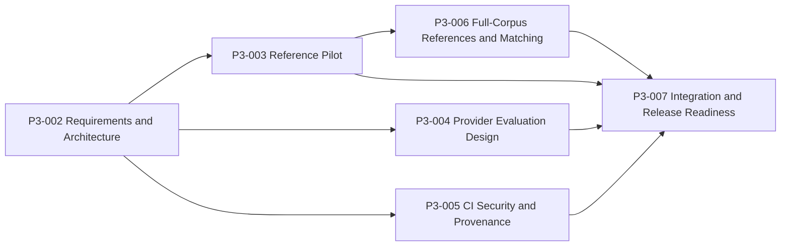

# v1.2 Execution Plan

Status: Approved planning sequence

Scope Decision: **A**

Formal version remains `v1.1.0`. No v1.2 candidate is assigned by this plan.

## Delivery Principles

- Every milestone starts with a new confirmed task alignment and current Git/CI evidence.
- Frozen M1 and released v1.0/`/v1.1` contracts are never changed opportunistically.
- Planned modules, commands, APIs, and UI below do not exist merely because they are named here.
- Reference processing is offline and derived. Real providers are default-off. CI security does not add a product runtime dependency.
- A milestone stops on test/build failure, unknown worktree drift, forbidden artifacts/secrets, scope expansion, or unresolved critical ambiguity.

## Dependency Graph

P3-003, P3-004, and P3-005 may be implemented in parallel only in isolated task scopes after P3-002 commits. P3-006 cannot begin before P3-003 PASS. P3-007 requires all predecessor evidence.

## P3-002 Product Requirements and Architecture

### Objective

Approve Scope Decision A, contracts, threat model, persistence lifecycle, evaluation budgets, compatibility, and executable gates without product implementation.

### Deliverables

- `docs/V1_2_PRD.md`
- `docs/V1_2_ARCHITECTURE.md`
- `docs/V1_2_DATA_MODEL.md`
- `docs/V1_2_THREAT_MODEL.md`
- `docs/V1_2_EVALUATION_PLAN.md`
- `docs/V1_2_ACCEPTANCE.md`
- this plan
- ADR 0006-0008
- updated v1.2 roadmap, project state, README planning links, and alignment

### Exit

Backend tests, Frontend build, consistency, Git, artifact, and secret checks pass. Local commit only; no push, candidate, tag, or Release.

## P3-003 Structured Reference Extraction Pilot

### Objective

Implement deterministic reference extraction and a validated JSONL derived-store pilot over fixtures and 50-100 local Articles. Do not run the full corpus.

### Planned Work Packages

1. **Contracts and fixtures**
   - Add model/serialization code matching `docs/V1_2_DATA_MODEL.md`.
   - Add at least 60 compact fixtures covering all normalization, negative, provenance, duplicate, and corruption cases.
2. **Extractor and normalizer**
   - Create a new reference-owned package, planned under `backend/app/references/`.
   - Read `StoredArticle` values without changing storage, parser, converter, validation, or sync.
   - Implement bounded Markdown-aware candidate extraction and complete classification.
3. **Deduplicator and provenance**
   - Implement exact identifier/URL rules and possible-text grouping.
   - Preserve complete evidence and reconcile source counts.
4. **Derived store**
   - Implement JSONL/index manifest, staged install, rollback, integrity, stale detection, and idempotent no-op.
5. **Read-only matching seam**
   - Define `ZoteroMatcher` against fake/unavailable providers only; no private library is required.
6. **Pilot runner and audit**
   - Planned CLIs under `scripts/references/` select deterministic strata, prohibit network, and write ignored output.
7. **Evaluation and report**
   - Run fixture/pilot metrics and human review under P3-003 acceptance thresholds.

### Allowed Future Implementation Boundary

- New `backend/app/references/`, `scripts/references/`, focused tests/fixtures, and P3-003 report/docs.
- Additive dependency/config changes only when justified by the approved design and separately aligned.

### Explicitly Excluded

- M1/parser/store mutation, full-corpus processing, live metadata lookup, private Zotero access, API/UI product endpoints, Graph integration, real provider.

### Exit Decision

- PASS: P3-006 may be planned.
- CONDITIONAL/BLOCKED: create P3-003.x; do not expand sample/full corpus.

## P3-004 Real Provider Evaluation Design

### Objective

Implement a unified evaluation adapter contract, consent/budget preflight, request-envelope allowlist, redacted report schemas, retention/deletion, and fake/dry-run tests. Make zero real requests.

### Planned Work Packages

1. Extend evaluation-owned models with `ProviderEvaluationRun` and `ProviderEvaluationCaseResult`.
2. Add embedding/chat adapter metadata without changing current provider default selection.
3. Implement mandatory real-run consent and hard request/cost/context/output/retry caps.
4. Add fixed metadata-only taxonomy fixtures and deterministic fake responses/errors.
5. Implement redaction, aggregate/redacted output, raw-off behavior, and safe deletion.
6. Prove default startup/CI cannot select real and no private data enters a request envelope.
7. Produce the P3-004 design/dry-run report.

### Allowed Future Implementation Boundary

- Evaluation/provider-owned modules, fake fixtures, ignored-output tooling, focused docs/tests.

### Explicitly Excluded

- Real/paid calls, credentials in fixtures/logs, product default/UI changes, user data, private Zotero data, full prompts/raw output by default.

### Exit Decision

- PASS does not authorize a real run. Any real run requires a new task naming provider/model, cases, data categories, request cap, cost cap, retention, and operator consent.

## P3-005 CI Security and Release Provenance

### Objective

Pin Actions immutably, enforce least privilege, add dependency/secret policy, generate a bounded CycloneDX SBOM, and verify exact-subject provenance without altering product runtime.

### Planned Work Packages

1. Resolve and review full SHA pins for current and new Actions; retain version comments.
2. Set workflow default `contents: read`; isolate SARIF and release attestation permissions.
3. Add Python lockfile, npm, and independent OSV-compatible dependency scanning.
4. Add tracked/bounded-history secret scanning with safe logging and a narrow allowlist.
5. Define/validate structured expiring suppressions and ownership.
6. Generate normalized CycloneDX 1.6 JSON from Python/npm lockfiles and scan it for forbidden content.
7. Add an exact-tag release-evidence job using GitHub artifact attestation for SBOM/evidence subjects only.
8. Document, but do not automatically change, branch protection and tag protection settings.
9. Preserve backend/frontend jobs and manual/tag Docker smoke.

### Allowed Future Implementation Boundary

- `.github/workflows/`, planned `.github/security/`, dependency-update config, security/SBOM scripts/tests, and P3-005 docs.

### Explicitly Excluded

- Runtime feature changes, package/container publication, broad write permissions, untrusted PR attestation, repository-setting external writes without approval, runtime/private artifact uploads.

### Exit Decision

- PASS is required for P3-007. Exact release attestation evidence still depends on a separately authorized tag/release operation.

## P3-006 Structured Reference Full-Corpus Build and Zotero Matching

### Objective

Build and audit the complete derived Reference Store from the then-current validated Article store, prove idempotency/recovery, and evaluate read-only matching. This requires separate authorization because it processes the full corpus.

### Planned Work Packages

1. Reconfirm Article count/fingerprint, backup, free capacity, ignored output, and zero-network guard.
2. Execute the full builder and classify every Article/candidate.
3. Audit schema, hashes, counts, indexes, source provenance, duplicate groups, and no Article mutation.
4. Repeat unchanged execution and require a validated no-op.
5. Inject corruption/install failures in fixtures and prove prior-store recovery.
6. Evaluate matching with fake/curated Zotero metadata.
7. If separately authorized, inspect only bounded private Zotero item metadata; never export the library or write Zotero.
8. Add bounded `/v1.2` reference read APIs and minimal Reader/Zotero UI only if the P3-006 task explicitly includes product integration. Otherwise defer those to P3-007.
9. Produce full-corpus report and operations inventory/backup classification evidence.

### Explicitly Excluded

- Remote metadata resolution, automatic matching decisions, Article/M1 write, Graph migration, full private library export, real provider.

### Exit Decision

- Extraction can PASS with fake/unavailable Zotero. A private local match run is optional evidence and separately authorized.

## P3-007 v1.2 Integration and Release Readiness

### Objective

Integrate approved reference API/UI surfaces, reconcile operations and compatibility, run complete security/release evidence gates, and decide whether a candidate may be assigned.

### Planned Work Packages

1. Finish additive `/v1.2` API and UI states if not completed under P3-006.
2. Protect legacy and `/v1.1` OpenAPI/response snapshots and all M3-M7 contracts.
3. Integrate Reference Store Tier 2 and review decisions Tier 1 into inventory, backup, restore, health, cleanup, and rebuild guidance.
4. Run P3-004 fake/dry-run safety; real quality remains optional.
5. Run Backend, Frontend, local/manual Docker, scanner, SBOM, provenance dry-run, docs, artifact, and secret gates.
6. Audit migration/rollback/corruption recovery for every new persisted format.
7. Classify findings and produce the release-readiness report.
8. Recommend candidate assignment only if all mandatory evidence passes.

### Explicitly Excluded

- Automatic tag/Release, silent gate waiver, prior tag movement, Graph/image/multi-user scope expansion.

### Exit Decision

- PASS permits a separate release-metadata/tag/Release task to be proposed. It does not itself authorize those writes.

## Cross-Milestone Traceability

| Requirement | Primary owner | Final evidence |
| --- | --- | --- |
| Reference schemas/normalization/provenance | P3-003 | Pilot + full-corpus reports |
| Atomic/idempotent Reference Store | P3-003 | Pilot integrity/failure tests; P3-006 full audit |
| Read-only Zotero candidate policy | P3-003/P3-006 | Fake/optional-local matching evidence |
| Additive API/UI | P3-006/P3-007 | OpenAPI, contract, and UI smoke |
| Provider consent/budget/redaction | P3-004 | Fake/dry-run design report |
| Immutable CI/scanners/SBOM/attestation | P3-005 | CI security report and exact-release evidence |
| Frozen compatibility and operations | P3-007 | Release-readiness report |

## Scope Change Procedure

- Any M1 or `metadata.references` change becomes a separately approved M1.x revision.
- Graph storage, remote image archive, authentication/multi-user, and public deployment require a future roadmap/architecture decision.
- A new provider data category, real call, private Zotero access, or full-corpus run requires explicit user authorization.
- New runtime persistence must define schema, tier, backup, migration, rollback, corruption recovery, privacy, and artifact policy before implementation.

## Stop Conditions

Stop the active milestone and report evidence when:

- a frozen contract must change;
- an unknown worktree modification or conflict appears;
- a required test/build/CI gate fails;
- an artifact/secret scan has a credible hit;
- scope cannot remain within the milestone;
- network/private/paid/full-corpus access is needed but not authorized;
- data identity, privacy, consent, or release provenance has unresolved critical ambiguity.

## User Approval Checkpoints

Explicit approval is required before:

1. P3-003 implementation.
2. Any private Zotero library access.
3. Any real-provider request and its exact budget/data scope.
4. P3-006 full-corpus processing.
5. External branch/tag protection setting changes.
6. Candidate assignment, tag creation, or GitHub Release.
